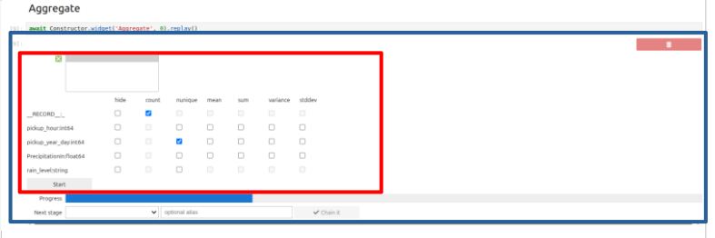

# The chaining widget architecture

## Why isn't `ProgressiBook` a notebook like the others?


In a standard notebook, any creation, execution, or deletion of a cell is triggered by a user action (a graphical event). The order in which cells are executed is not enforced by the system (though it may be enforced by the semantics of the code).

In contrast, in a `ProgressiBook`, all of these actions (with the exception of bootstrap and snippets) are triggered programmatically by the kernel in response to graphical events initiated by the user via ipywidgets (clicks, selections, etc.).

## The bootstrap

When created, a `ProgressiBook` is never empty; it already contains two cells:

1. A Markdown cell displaying the "Run ProgressiVis" button, which allows you to trigger the bootstrap with a single click
2. A code cell containing the actual bootstrap code


Without going into detail (which is covered more extensively in the comments in [utils.py](https://github.com/progressivis/ipyprogressivis/blob/main/ipyprogressivis/widgets/chaining/utils.py)), here are the actions performed by the bootstrap (code below):

* get the header,  an (unique) object which groups toghether all the components necessary for the bootstrap process described below (`Talker`, `BackupWidget` etc.)
* display of the `Talker` widget (a custom ipywidget) that facilitates communication between the kernel and the frontend via standard [JupyterLab commands](https://jupyterlab.readthedocs.io/en/stable/user/commands.html) as well as [custom commands](https://github.com/progressivis/ipyprogressivis/blob/main/ipyprogressivis/js/src/labplugin.js). This dialogue is one-way.
* display of the `BackupWidget`. Since the dialogue via commands is one-way, it is not sufficient to ensure the backup, which must be both written (for the backup) and read (for the replay). This is where the `BackupWidget` comes into play.
* header.board displays (in a separate panel) a dashboard that allows you to monitor the activity of the progressive modules.
* header.manager displays (in another panel) the DAG of the `c-widgets`.

```python
from ipyprogressivis.widgets.chaining.constructor import Constructor
from ipyprogressivis.widgets.chaining.utils import create_root, get_header
from ipyprogressivis.widgets.chaining.custom import *
# ***************************************************************************************
# WARNING: This cell must only be executed using the 'Run ProgressiVis' button above.
# Do not execute it in any other way, as the result will not be as expected.
# For the same reason do not copy/paste the contents of this cell to execute it elsewhere
# ***************************************************************************************
header = get_header()
display(header.talker)
display(header.backup)
_ = header.constructor
with header.modules_out:
    display(header.board)
with header.widgets_out:
    display(header.manager)
header.talker.labcommand("notebook:hide-cell-code")
%reload_ext ipyprogressivis.magics
create_root(header.backup)
```


## The place of the chaining widget (alias `c-widget`) in `ProgressiBook`

When creating a `ProgressiBook`, you will find a simple interface that allows you to create a data loader. Currently, you can choose between a `CSV`, `PARQUET`, or `Custom` loader.

After creating and launching a loader (any one), the user will see a progress bar followed by a horizontal chaining bar containing:

* a "Next stage" dropdown list allowing you to choose a widget from a list
* an input field to give an alias to the element to be created
* a "Chain it" button to activate the chaining with another widget


Each new chained element consists of two parts:

* a generic "carrier" component (blue rectangle below), responsible for:
  * hosting the chaining widget (`c-widget`)
  * the chaining logic
  * displaying information common to all `c-widgets` (progress bar, quality bar)
* a specialized, "hosted" by the "carrier" above (red rectangle below) component capable of performing the task selected in "Next stage". In the rest of this document, when there is no possibility of confusion with the "carrier" we will refer to it as chaining widget or `c-widget`. It's Python implementation is often called "guest" (e.g. [utils.py](https://github.com/progressivis/ipyprogressivis/blob/main/ipyprogressivis/widgets/chaining/utils.py)).




In concrete terms, the carrier widget is a vertical box (VBox) containing three elements:

* A header bar currently containing the red button for deleting the element
* The `c-widget`
* A footer that can contain one or more horizontal bars:
  * a chaining bar
  * a progression bar
  * a quality bar
  * a dataviz management bar

The bars are displayed by default when they are technically relevant, but they can be disabled individually (via class decorators) when they are not semantically relevant.

## Focus on the `c-widget`

In the following, we refer to the `ipyprogressivis.widgets.chaining.utils` module as `.utils`.

A `c-widget` class is a class that inherits from `.utils.VBox`. To make it visible in the toolkit UI, it must be decorated with `@utils.chaining_widget(label="A label")`.

For example, the `c-widget` class AggregateW is defined as follows:

```python
@chaining_widget(label="Aggregate")
class AggregateW(VBoxTyped):
    ...
```

and it will be visible in the interface with the label "Aggregate".


### Inheritance

The `c-widget` class inherits three important instance attributes:

- `self.input_module: Module` representing the `ProgressiVis` module provided as input
- `self.input_slot: str` the name of the default slot
- `self.input_dtypes: dict[str, str]` or its alias `dtypes: dict[str, str]` provides, under certain conditions (see the initialize method below), a dictionary containing the column=>type mapping)

The `ProgressiVis` scheduler is accessible via `self.input_module.scheduler`.

```{eval-rst}

.. note::
       When ``self.input_module`` contains an instance of the ``Sink`` class, this means that the current module does not receive input data. Therefore the current ``c-widget`` class is a data loader or generator. However, ``self.input_module`` is still useful for providing access to the scheduler.
```

### Constructor

The `c-widget` class constructor has several special features:

- It is not intended to be called in the user's code.
- Instantiation is performed solely by the toolkit, without arguments, so every `c-widget` inherits a constructor without arguments.
- The `c-widget` class can define its own constructor(mainly to define and initialize attributes, never to create sub-widgets), but it must also be without arguments and must call `super().__init__()`.


### The initialize() method

- The `c-widget` class must always define an `initialize()` method that will be called by the toolkit after instantiation. This method is responsible for creating the sub-widgets that make up the initial composition of the `c-widget` and assigning them to the attributes declared by the Typed class using the syntax described above. This composition may evolve later as a result of interactions with the user.

- When a scenario is replayed, the role of `initialize()` method is to restore the widget's state from the backup. This restoration occurs in exactly the same way in most cases. To avoid repetition, the `@restore_on_replay` decorator should be applied to `initialize()`, and the body of the method should provide only the logic for the first execution (see `aggregate.py`). When the decorator is not applied, the `initialize` method must handle both situations (first execution and replay) by checking the state of the `is_replaying` attribute (see [csv_loader.py](https://github.com/progressivis/ipyprogressivis/blob/main/ipyprogressivis/widgets/chaining/csv_loader.py) example).

To ensure `c-widgets` persistence and enable replay, ipyprogressivis recommends building interfaces using `ipywel` (the ipywidgets expression language, described [here](ipywel-intro)). For this reason, the initialize() method typically has the following structure:

```python
@chaining_widget(label="MyLabel")
class MyCWidgetW(VBox):
    ...
    @restore_on_replay
    def initialize(self) -> None:
        ...
        self._proxy = anybox(
            self,
	    ...
	)
	...
```

In this approach, each widget that is part of the interface is wrapped by a proxy object that records all interactions with the widget that could change its state. The _proxy attribute stores the wrapper for the root widget of the `c-widget`.

The use of ipywel explains why the widget callbacks in existing `c-widgets` have an additional parameter: the proxy:

```python
    def cbx_observer(self, proxy: Proxy, change: AnyType) -> None:
        ...

```


### The different tasks of a `c-widget` class

Usually a `c-widget` class can perform one or more tasks among:

- enrich the existing dataflow with new modules
- add callbacks to modules or the scheduler
- produce a dynamic visualization, most often animated by a callback associated with a module or the scheduler
- create virtual (calculated) columns on the output tables

### Operating modes

The above roles can be performed in three modes:

- Creation mode: most often triggered by the callback of a button often called `start_btn`, always decorated with `@starter_callback`
- Stirred (step-by-step) replay mode: a step-by-step and interactive replay of a scenario previously recorded. At each step the user has the choice between:
  - replaying the step as-is
  - edit/modify/replay the current stage or add new stages to the scenario.
- Batch replay mode: replay in one go a scenario previously recorded.

Both replay modes (stirred and batch) are processed via a method called `run` and decorated with `@runner`. The behaviour difference between the stirred mode and the batch mode is made by `@runner`.

Since all modes trigger the same processing, their common core must be located in a unique, dedicated method.

This method is usually called `init_modules()`, but this name is not mandatory.

If the method creates new modules (which is usually the case), it must be decorated with `@modules_producer`, which records useful information in case the widget and underlying modules are deleted and set the `output_dtypes` attribute.


For example, the `c-widget` `AggregateW` has the following method:


```python
    @modules_producer
    def init_modules(self, compute: AnyType) -> Aggregate:
    	...
```


which creates the `Aggregate` module and adds it to the dataflow.
It is called in two places:

1. In the `start_btn` button callback for interactive mode:

    ```python
	@starter_callback
	def _start_btn_cb(self, proxy: Proxy, btn: ipw.Button) -> None:
	    compute = [
		("" if col == RECORD else col, fnc)
		for ((col, fnc), ck) in self.info_cbx_dict().items()
		if fnc != "hide" and ck.widget.value
	    ]
	    assert self._proxy is not None
	    self.record = self._proxy.dump()
	    self.output_module = self.init_modules(compute)
	    self.output_slot = "result"
    ```

    ```{eval-rst}

    .. note::
	   Since a widget can contain multiple buttons, the ``@starter_callback`` decorator is used only on the button that triggers the main processing (i.e. it calls ``self.init_modules()``). The decorator will add processing specific to that role.
    ```

2. in the `run()` method, decorated by `@runner` for the replay modes:

    ```python
	def run(self) -> AnyType:
	    # get compute
	    compute = [
		("" if col == RECORD else col, fnc)
		for ((col, fnc), ck) in self.info_cbx_dict().items()
		if fnc != "hide" and ck.widget.value
	    ]
	    self.output_module = self.init_modules(compute)
	    self.output_slot = "result"
    ```

We can see that in interactive mode, the content (the underlying `ipywel` widgets tree), available in `self._proxy` is saved for possible future use via `self.record` setting before being used to call init_modules().


In replay mode , the call parameters for `init_modules()` are obtained from the widgets already restored thanks to the action `@restore_on_replay` decorator applied to `initialize()` (or by the action of `initialize()` when the decorator is missing):

### `c-widget` typology

According to the tasks performed:

* module creator `c-widget`
* visualization creator `c-widget`
* both module+visualization creator `c-widget`

According to their place in the topology

* Node `c-widget`
* Leaf `c-widget`


#### `c-widget` module creator

Some `c-widgets` are designed to enrich the data flow with new modules and/or create calculated columns on tables (GroupBy, Aggregate, Join, etc.). Their UI is usually disabled in replay mode, except if you choose the "Edit" option available  with the "step by step" mode. These `c-widgets` are intended to produce data for other `c-widgets` with which they are linked.

In order to ensure connectivity, their `self.init_modules()` method should populate the `self.output_module` and `self.output_slot` attributes. Populating `self.output_dtypes` is optional because this information is often unknown at the time of creation and the toolkit is able to produce this information via `@modules_producer` post-processing.

#### visualization creator `c-widgets`

Do not create modules, but probably a callback on the output module of the previous widget and a visualization that will be refreshed by this callback. The UI is divided into two parts:
1. Settings depending on the visualization capabilities may be partially frozen during replay.
2. Progressive data visualization.
Examples: `Dump table` and `AnyVega`.

#### `c-widget` module creator + data visualization

This is the case with Heatmap, which needs the Histogram2D module to produce a "density map" or heatmap visualization.


#### Node `c-widget`

This is a `c-widget` that accepts other `c-widgets` attached downstream. Logically, it necessarily creates at least one module. Its `init_modules()` method must provide the output attributes (at least output_module and output_slot).

#### Leaf `c-widget`

Unlike  the Node `c-widget`, the Leaf `c-widget` prevents the chaining of new widgets.

The typical case is that of a `c-widget` producing a visualization.

Since the chaining bar is displayed by default in the footer, a `c-widget` class must be decorated with `@is_leaf` to prevent the chaining bar from being displayed. For example:

```python
@is_leaf
# ...
@chaining_widget(label="Any Vega")
class AnyVegaW(VBoxTyped):
    ...
```

#### Other footer-related decorators

Additionnaly:

* `@no_progress_bar`  prevents the progress bar from being displayed when irrelevant
* `@no_quality_bar`  prevents the quality bar from being displayed when irrelevant

```python
@is_leaf
@no_progress_bar
@chaining_widget(label="Any Vega")
class AnyVegaW(VBoxTyped):
    ...
```

#### Implement a visualization creator `c-widget`

The basic way to integrate progressive visualization into a `c-widget` is described [here](https://progressivis.readthedocs.io/en/latest/userguide.html#communication-between-progressivis-and-the-notebook).

However, if you want to accompany the visualization with a horizontal bar integrated into the footer that allows you to manage the display frequency , proceed as follows:

1. Define a subclass of `utils.Coro`
2. Implement the asynchronous method `action()` on this subclass with this signature. For example:

```python
class AfterRun(Coro):
    async def action(self, m: Module, run_number: int) -> None:
    	...
```
3. Instantiate this subclass by passing the target module as an argument to the constructor. The module in question may or may not be produced by `init_modules()` (for example, `self.input_module` can be used even though it is not created by `init_modules()`)
4. Assign this instance to the `after_run` attribute of `c-widget`

In general, the right place to implement steps 2, 3, and 4 is the init_modules() method. For example:

```python
@is_leaf
@no_progress_bar
@chaining_widget(label="Heatmap")
class HeatmapW(VBoxTyped):
     ...
      @modules_producer
      def init_modules(self, ctx: dict[str, AnyType]) -> Heatmap:
         ...
         self.after_run = AfterRun(heatmap)
	 ...
```

```{eval-rst}

.. note::
       Most often, the widgets used for progressive visualization are custom widgets that are compatible with ipywidgets but are not supported by ipywel. Such support would, in fact, be pointless because the state of these widgets changes with each ``run_step``, so saving them would be unnecessary. One tip for integrating them into the ``c-widgets`` ``ipywel`` tree is to create an empty ``box()`` at the desired insertion point. The visualization widget will be created and attached on the fly as a child of this box, as shown here (follow ``vega_box`` uid in `any_vega.py <https://github.com/progressivis/ipyprogressivis/blob/main/ipyprogressivis/widgets/chaining/any_vega.py>`_ to see the complete example):
```


```python
class AnyVegaW(VBox):
    ...
    @modules_producer
    def init_modules(
        self, mapping_dict: dict[str, dict[str, str]], vega_schema: AnyType
    ) -> None:
        ...
        vegabox = self._proxy.that.vega_box.widget
        assert hasattr(vegabox, "children")
        if not vegabox.children:
            vegabox.children = [VegaWidget(spec=vega_schema)]

class AfterRun(Coro):
    columns: list[str] = []
    async def action(self, m: Module, run_number: int) -> None:
        ...
        def _func() -> None:
	    ...
            vega_box.children[0].update("data", remove="true", insert=data)
        await asynchronize(_func)
```


#### The visual rendering of a `ProgressiBook` when loading and in replay mode

When loading a `progressibook`, the widgets are rendered using the standard mechanisms of `ipywidgets`.

Since the `progressibook` cells are created programmatically, the `progressibook` is not considered reliable by `Jupyterlab`, which only recognizes as reliable cells created and executed by human interactions.

For this reason, in order to benefit from the graphical visual rendering, the `progressibook` must be "signed" either in the `Jupyterlab` interface or with the command:

```sh
jupyter trust /path/to/my/file.ipynb
```

**NB:** Recent versions of JupyterLab (>=4.6.0) detect untrusted notebooks when they are opened and allow you to mark them as trusted with a single click.
